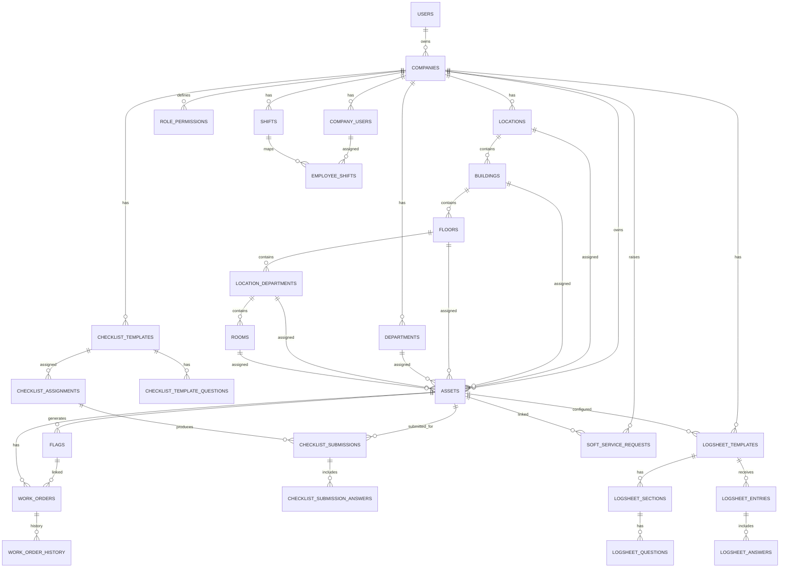

# FM ER Diagram (Core Domain)

This is a readable core ER diagram for the main operational flow.
For the complete FK list across all tables, use `backend/ERD_RELATIONS.md`.

## Notes

- `role_permissions` stores per-role JSON CRUD policy by module/tab.
- `company_users.permissions` can store user-level overrides.
- `company_users.module_access` stores tab visibility overrides.
